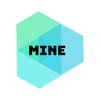

# Mine

## A central media aggregator for the things _you_ love

## Media Is Never Easier

With the rapid proliferation of online content through an ever-increasing number of online streaming services as well as social networks, it can be hard to find something which one might want to devote their time and attention to. With shorter attention spans and ever tighter schedules, there is a huge trove of online content which vies for our attention at any given time. This ever burgeoning store of online content paradoxically leads to indecisiveness in the minds of users, with an additional tedium of logging in and searching every single online providers’ portals for something which one would want to potentially consume. This is where Mine comes in, acting as a central hub for searching and discovering content which a user might like.

Mine would allow users to search for online content from a myriad of online content providers by specifying a search term and a desired category. Mine would then aggregate search results from a myriad of online content providers to present users with the most relevant results based on their specific search terms. Mine would also allow users to peruse their previous searches in order to find something else they might like,related to content they searched for earlier. Finally, Mine would also promote an online community of users by showing what’s trending, so that users can find something tha tthey would want to consume and feel connected to a larger community in the world at large.
